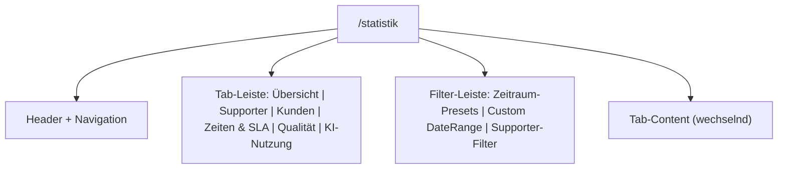
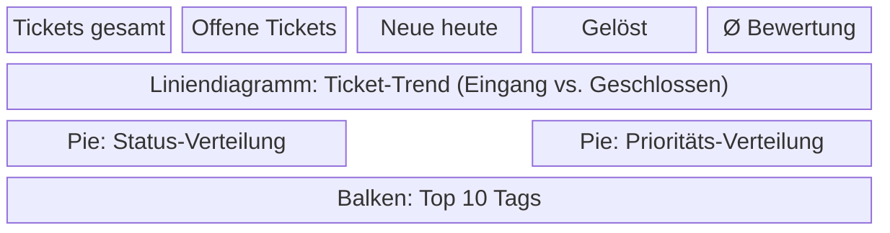
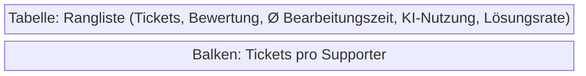
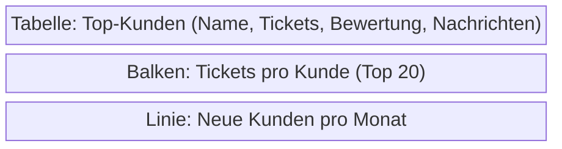
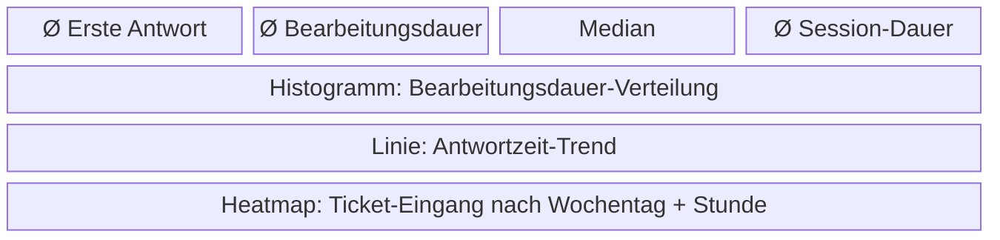
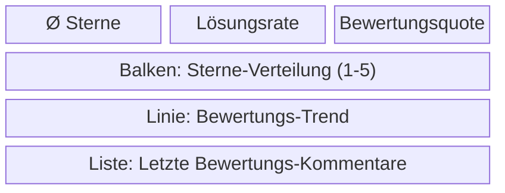
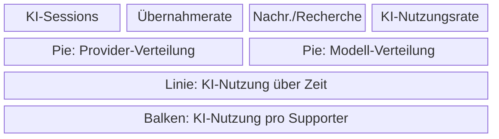

# ams.SupportDesk – Projektplan

**Erstellt:** 14.03.2026
**Stand:** 27.03.2026
**Phase:** Phase 1 abgeschlossen, Phase 1.1 Bugfixes & UI-Verbesserungen abgeschlossen, Phase 1.2 RAG-Collections Toggle abgeschlossen, Phase 2 KI-Integration abgeschlossen, Phase 3 Statistik & Analytics abgeschlossen, Phase 3.1 MCP-Server Auth-Fix & Tool-Verbesserungen abgeschlossen, Phase 3.2 RAG-Fixes & MCP-Datumserweiterung abgeschlossen, Phase 3.3 RAG-Query-Optimierung & Chat-UI-Verbesserungen abgeschlossen, Phase 4.0 SDK-Integration (ams-llm + ams-thoster) abgeschlossen, Phase 4.1 Hilfe-Seite & Help-API abgeschlossen, Phase 4.2 Frontend-Migration Tailwind CSS v4 abgeschlossen, Phase 4.3 MCP-Server Schreiboperationen & Server-Instructions abgeschlossen, Phase 4.4 MCP-Server tickets_auflisten Erweiterung & _find_ticket_by_nummer Mitigation abgeschlossen

---

## Projektuebersicht

ams.SupportDesk ist ein KI-gestuetztes Support-Tool, das Supporter, Kunden und KI-Recherche in einer integrierten Plattform vereint. Das System laeuft vollstaendig in der THoster-Infrastruktur hinter einem Traefik Reverse Proxy.

---

## Meilensteine

| Meilenstein       | Zieldatum  | Status        |
|-------------------|------------|---------------|
| Phase 1: Grundsystem | 14.03.2026 | Abgeschlossen |
| Phase 1.1: Bugfixes & UI-Verbesserungen | 14.03.2026 | Abgeschlossen |
| Phase 1.2: RAG-Collections Toggle | 14.03.2026 | Abgeschlossen |
| Phase 2: KI-Integration (LLM-Router, Recherche-Chat, Ticketnummern) | 14.03.2026 | Abgeschlossen |
| Phase 3: Statistik & Analytics | 15.03.2026 | Abgeschlossen |
| Phase 3.1: MCP-Server Auth-Fix & Tool-Verbesserungen | 15.03.2026 | Abgeschlossen |
| Phase 3.2: RAG-Fixes & MCP-Datumserweiterung | 15.03.2026 | Abgeschlossen |
| Phase 3.3: RAG-Query-Optimierung & Chat-UI-Verbesserungen | 15.03.2026 | Abgeschlossen |
| Phase 4.0: SDK-Integration (ams-llm + ams-thoster) | 15.03.2026 | Abgeschlossen |
| Phase 4.1: Hilfe-Seite & Help-API | 18.03.2026 | Abgeschlossen |
| Phase 4.2: Frontend-Migration Tailwind CSS v4 | 21.03.2026 | Abgeschlossen |
| Phase 4.3: MCP-Server Schreiboperationen & Server-Instructions | 27.03.2026 | Abgeschlossen |
| Phase 4.4: MCP-Server tickets_auflisten Erweiterung & N+1-Mitigation | 27.03.2026 | Abgeschlossen |

---

## Phase 1 – Abgeschlossen

### Backend (FastAPI + SQLAlchemy 2.0 async)

- [x] Projektstruktur und Docker-Setup
- [x] PostgreSQL 16 mit asyncpg-Anbindung
- [x] Redis 7 fuer Session/Cache
- [x] Pydantic Settings und Konfigurationsmanagement
- [x] Auth-Middleware (Cookie-basiert, Kuerzel-Login)

**Datenmodelle (13 Stueck):**
- [x] Supporter (Kuerzel-basierte Authentifizierung)
- [x] Kunde (Kundenstammdaten)
- [x] Ticket (mit vollstaendiger Statusmaschine)
- [x] TicketTag (Kategorisierungs-Tags)
- [x] ChatSession (Verbindung Ticket <-> Chat)
- [x] Nachricht (Kunden- und Supporter-Nachrichten)
- [x] KIRechercheVerlauf (KI-Session pro Ticket)
- [x] KINachricht (Einzelne KI-Antworten)
- [x] Bewertung (Post-Close Kundenbewertung)
- [x] Template (Antwort-Vorlagen)
- [x] PhasenText (Automatische Statusuebergangstexte)
- [x] MCPServerRegistry (Registrierte MCP-Server)
- [x] AppSetting (Key-Value App-Einstellungen)

**API-Router (12 Stueck):**
- [x] auth (`/api/auth`) – Login, Logout, Session-Check
- [x] kunden (`/api/kunden`) – CRUD Kundenverwaltung
- [x] kunden_portal (`/api/portal`) – Kunden-seitige Endpunkte (Ticket per Nummer)
- [x] tickets (`/api/tickets`) – Ticket-CRUD + Statusaenderungen + Nummer in Response
- [x] tags (`/api/tags`) – Tag-Verwaltung
- [x] chat_sessions (`/api/chat-sessions`) – Session-Verwaltung
- [x] nachrichten (`/api/nachrichten`) – Nachrichtenversand, -abruf und Delete (Supporter)
- [x] eingangskorb (`/api/eingangskorb`) – Neue/unzugewiesene Tickets mit Nummer
- [x] connections (`/api/connections`) – ams-connections/Agent Hub
- [x] ki_recherche (`/api/v1/ki-recherche`) – KI-Recherche-Chat, LLM-Aufrufe, RAG (Phase 2)
- [x] ws (`/api/ws`) – WebSocket fuer Echtzeit-Updates
- [x] admin (`/api/admin`) – Templates, Phasen, MCP-Sync, RAG, Modelle, KI-Systemprompt

**Services:**
- [x] ConnectionManager (WebSocket-Verbindungsverwaltung)
- [x] ConnectionsClient (SDK-Wrapper via ams-llm SDK – Phase 4.0)
- [x] LLMRouter / `complete()` (Phase 2/4.0 – SDK-basierte LLM-Aufrufe)

**Ticket-Statusmaschine:**
- [x] eingang → in_bearbeitung
- [x] in_bearbeitung → wartet / geloest
- [x] wartet → in_bearbeitung / geloest
- [x] geloest → bewertung
- [x] bewertung → geschlossen

---

### Frontend (React 18 + Vite + TypeScript + Chakra UI v3)

- [x] Vite-Projektsetup mit TypeScript-Konfiguration
- [x] Chakra UI v3 Theme mit Primaerfarbe #003459
- [x] React Router Setup
- [x] API-Client (`lib/api.ts`) mit Cookie-Handling
- [x] TypeScript-Typdefinitionen (`lib/types.ts`)

**Seiten & Hauptkomponenten:**
- [x] SupporterLogin – Kuerzel-basierter Login
- [x] TicketList – Tabs (Meine / Eingang / Alle)
- [x] TicketDetail – Detailansicht mit Statusaenderung
- [x] TicketCreate – Ticket-Erstellungsformular
- [x] TagEditor – Inline Tag-Bearbeitung
- [x] Eingangskorb + EingangskorbItem – WebSocket-Live-Updates
- [x] TicketWorkspace – Split-Layout Support-Arbeitsplatz
- [x] KundenChat – Chat-Bereich links im Workspace
- [x] KIChat – KI-Recherche-Bereich rechts im Workspace
- [x] PortalLogin – Kunden-Authentifizierung
- [x] PortalChat – Kunden-Chat-Interface
- [x] PortalMessageBubble – Chat-Nachrichtenblase
- [x] AdminPage – Tab-basierte Admin-Verwaltung
- [x] TemplateManager – Antwortvorlagen-Verwaltung
- [x] PhasenTexteManager – Phasenubergangs-Texte
- [x] ModelleManager – KI-Modellkonfiguration
- [x] MCPServerManager – MCP-Server-Registrierung und Sync
- [x] RAGCollectionManager – RAG-Collections
- [x] SettingsManager – App-Einstellungen
- [x] MarkdownRenderer – Markdown + Mermaid-Rendering

**Custom Hooks:**
- [x] useAuth – Authentifizierungsstatus und Login-Flow
- [x] useTickets – Ticket-Datenabruf und -mutationen
- [x] useWebSocket – WebSocket mit Auto-Reconnect

---

### MCP-Server (FastMCP 2.x)

- [x] FastMCP 2.x Setup mit Streamable HTTP
- [x] Traefik-Integration (Prio 40, /mcp Pfad)
- [x] Tool: `tickets_auflisten` (mit Ticketnummern + Supporter-Kuerzel)
- [x] Tool: `ticket_details` (Parameter: `ticket_nummer: int`)
- [x] Tool: `ticket_suchen` (mit vollstaendigen Ticketnummern)
- [x] Tool: `eingangskorb_anzeigen` (mit Ticketnummern)
- [x] Tool: `kunde_suchen`
- [x] Tool: `tags_auflisten`
- [x] Internes Service-Token (`X-Internal-Token`) fuer Auth ohne Cookie (Phase 3.1)

---

## Phase 4.3 – MCP-Server Schreiboperationen & Server-Instructions (27.03.2026)

### MCP-Server Erweiterungen

- [x] `FastMCP`-Konstruktor mit `instructions`: server-level Guidance fuer das LLM (welches Tool wann, Statusmaschine, Hinweise zu Schreiboperationen)
- [x] `ticket_suchen`: Limit auf 200 Tickets gedeckelt (vorher unbegrenzt – schützt vor zu grossen Payloads)
- [x] Neues Tool: `ticket_status_aendern` – Status eines Tickets aendern mit Elicitation-Bestaetigung (FastMCP `ctx.elicit()`, Pydantic `BaseModel`/`Field`)
- [x] Neues Tool: `ticket_uebernehmen` – Ticket aus dem Eingangskorb uebernehmen und auf `in_bearbeitung` setzen mit Elicitation-Bestaetigung
- [x] Imports: `Context`, `AcceptedElicitation`, `DeclinedElicitation` aus `fastmcp.server.context`; `BaseModel`, `Field` aus `pydantic`

---

## Phase 4.4 – MCP-Server tickets_auflisten Erweiterung & N+1-Mitigation (27.03.2026)

### MCP-Server Verbesserungen

- [x] `tickets_auflisten`: gibt jetzt zusaetzlich `prioritaet` und `ki_bewertung` aus – `ticket_details` ist dadurch fuer reine Uebersichtsabfragen seltener noetig
- [x] Server-Instructions aktualisiert: `tickets_auflisten` beschreibt nun die vollstaendige Feldliste (Nummer, Titel, Status, Prioritaet, KI-Bewertung, Kunde, Supporter, Datum, Tags)
- [x] `_find_ticket_by_nummer`: Limit von 200 auf 50 reduziert als Mitigation gegen ueberlange Payload-Ladestoesse; Kommentar dokumentiert den N+1-Effekt und empfiehlt Backend-Filter `?nummer=X` als saubere Loesung

---

### Infrastructure & DevOps

- [x] Docker Compose mit 5 Services
- [x] PostgreSQL 16 mit Health-Check
- [x] Redis 7 mit Health-Check
- [x] Traefik-Labels fuer alle 3 Applikations-Services
- [x] THoster-Netz-Integration (`thoster-net`)
- [x] .env.example mit allen noetigen Variablen
- [x] .gitignore (Python, Node, .env, IDE, OS)
- [x] THoster-Registrierungsdatei (`register-ams-supportdesk.json`)
- [x] Initialer Git-Commit

---

## Phase 1.1 – Bugfixes & UI-Verbesserungen (14.03.2026)

### Backend-Fixes

- [x] MCP-Server Sync: `mcp_server_address` aus THoster API statt Docker-Konvention ableiten
- [x] MCP-Server Sync: Neue Server werden deaktiviert angelegt (`is_active=False`)
- [x] MCP-Server Sync: Tools ohne `mcp_server_address` werden uebersprungen oder entfernt, nicht angelegt
- [x] MCP-Server Sync: Sync-Ergebnis liefert jetzt `synced`, `skipped`, `removed` und `total_tools`
- [x] RAG-Collections: Backend erkennt RAG-Backend-URL automatisch aus Docker-Konvention (mehrere Kandidaten-URLs werden probiert)
- [x] RAG-Collections: Robusteres Fehlerhandling, kein Abbruch bei nicht erreichbaren Kandidaten

### Frontend-Fixes & UI-Verbesserungen

- [x] MCPServerManager: Klick auf Server-Card oeffnet direkt den Bearbeiten-Dialog
- [x] MCPServerManager: Aktiv/Inaktiv-Toggle als separater Button statt Checkbox im Formular
- [x] MCPServerManager: Loeschen-Aktion mit Muelleimer-Symbol statt Textlink
- [x] MCPServerManager: Aktive Server werden oben sortiert (alphabetisch innerhalb der Gruppe)
- [x] MCPServerManager: Verzoegertes Umsortieren nach Toggle (kein sofortiges Springen in der Liste)
- [x] MCPServerManager: Standard-Transporttyp auf `streamable_http` geaendert
- [x] MCPServerManager: Neue Server werden standardmaessig deaktiviert angelegt
- [x] MarkdownRenderer: `children` prop korrekt an ReactMarkdown uebergeben (Bug behoben)
- [x] Verbesserte Fehlerbehandlung in Admin-Komponenten

---

## Phase 1.2 – RAG-Collections Toggle (14.03.2026)

### Frontend-Erweiterungen

- [x] RAGCollectionManager: Toggle zum Aktivieren/Deaktivieren pro Collection (analog zu MCPServerManager)
- [x] RAGCollectionManager: Aktive Collections werden oben sortiert, inaktive alphabetisch darunter
- [x] RAGCollectionManager: Aktivierungszustand wird in App-Settings unter Key `rag_active_collections` (JSON-Array) persistiert
- [x] RAGCollectionManager: Badge zeigt Anzahl aktiver Collections in der Ueberschrift
- [x] RAGCollectionManager: State wird beim Laden parallel aus `/admin/rag-collections` und `/admin/settings` bezogen

---

## Phase 2 – Abgeschlossen (14.03.2026)

### Backend – KI-Integration

- [x] `services/llm_router.py` – LLM-Provider-Abstraktion
  - [x] `LLMProvider` ABC-Basisklasse
  - [x] `OpenAICompatibleProvider` fuer OpenAI, Ollama, vLLM, Groq, Mistral
  - [x] `AnthropicProvider` fuer Anthropic Claude (eigenes API-Format)
  - [x] `LLMRouter.create_provider()` Factory-Methode
- [x] `routers/ki_recherche.py` – KI-Recherche-API (`/api/v1/ki-recherche`)
  - [x] GET/POST Verlauf pro Ticket
  - [x] GET/POST/DELETE Nachrichten pro Verlauf
  - [x] PATCH Nachricht als uebernommen markieren
  - [x] LLM-Aufruf mit Ticket-Kontext als System-Prompt
  - [x] RAG-Kontext-Integration (per Anfrage oder aus Settings)
  - [x] WebSocket-Broadcast von KI-Antworten
  - [x] Konfigurierbarer System-Prompt (aus AppSetting `ki_system_prompt`)
- [x] `config.py` – `OPENAI_API_KEY` und `ANTHROPIC_API_KEY` Settings
- [x] `main.py` – KI-Recherche-Router registriert
- [x] `models/ticket.py` – Ticketnummer (auto-increment, Integer)
- [x] `schemas/ticket.py` – `nummer` in Response-Schemas
- [x] `routers/tickets.py` – `nummer` in API-Responses
- [x] `routers/eingangskorb.py` – `nummer` in Eingangskorb-Items
- [x] `routers/kunden_portal.py` – Ticket-Identifizierung per Nummer statt UUID; `nummer` in Responses
- [x] `routers/nachrichten.py` – DELETE-Endpoint fuer Supporter-Nachrichten
- [x] `routers/admin.py` – Default-Systemprompt-Endpoint (`/admin/ki/default-system-prompt`)

### Frontend – KI-Integration & UI

- [x] `lib/types.ts` – `nummer` in `Ticket` und `EingangskorbItem`
- [x] `App.tsx` – `ticketNummer` wird in Routing durchgereicht
- [x] `components/workspace/TicketWorkspace.tsx`
  - [x] Echte KI-API-Aufrufe statt Mock
  - [x] RAG-Collection-Auswahl pro Anfrage
  - [x] Aktiver Panel-Indikator (linker/rechter Bereich)
  - [x] Delete-Handler fuer Nachrichten
- [x] `components/workspace/KIChat.tsx`
  - [x] Loading-State waehrend LLM-Aufruf
  - [x] RAG-Badges fuer aktive Collections
  - [x] Kontext-Block mit Ticket-Informationen
  - [x] Loeschen-Buttons fuer KI-Nachrichten
  - [x] Fokus-Indikator fuer Panel-Zustand
  - [x] Template-Picker-Integration (/-Trigger)
- [x] `components/workspace/KundenChat.tsx`
  - [x] Loeschen-Button fuer Supporter-Nachrichten
  - [x] Fokus-Indikator fuer Panel-Zustand
  - [x] Template-Picker-Integration (/-Trigger)
- [x] `components/portal/PortalLogin.tsx` – Login per Ticketnummer statt UUID
- [x] `components/portal/PortalChat.tsx` – Ticketnummer anzeigen
- [x] `components/eingangskorb/EingangskorbItem.tsx` – Ticketnummer anzeigen
- [x] `components/tickets/TicketList.tsx` – Ticketnummer anzeigen
- [x] `components/admin/AdminPage.tsx` – KI-Einstellungen und Einstellungen als separate Tabs
- [x] `components/admin/SettingsManager.tsx` – Nur allgemeine Settings (ohne KI-Prompt)
- [x] `components/admin/KISettingsManager.tsx` – KI-Einstellungen: konfigurierbarer Systemprompt
- [x] `components/shared/TemplatePicker.tsx` – Wiederverwendbarer Template-Picker mit /-Suche und Keyboard-Navigation

---

## Phase 3.1 – MCP-Server Auth-Fix & Tool-Verbesserungen (15.03.2026)

### Backend – Internes Service-Token

- [x] `backend/app/config.py` – Neue Setting `internal_api_key` (leer = deaktiviert)
- [x] `backend/app/middleware/auth.py` – `get_current_supporter` prueft zuerst `X-Internal-Token` Header
  - [x] Hilfsfunktion `_get_or_create_system_supporter()` erstellt automatisch SYSTEM-Supporter bei Bedarf
  - [x] Internes Token hat Vorrang vor Cookie-Session; kein Cookie erforderlich fuer Dienst-zu-Dienst-Kommunikation
- [x] `.env` / `.env.example` – `INTERNAL_API_KEY` Variable hinzugefuegt (Pflichtfeld fuer Produktion)
- [x] `docker-compose.yml` – `INTERNAL_API_KEY` Umgebungsvariable an MCP-Server-Service weitergegeben

### MCP-Server – Tool-Verbesserungen

- [x] `mcp-server/server.py` – `INTERNAL_API_KEY` aus Umgebungsvariable lesen
- [x] Hilfsfunktion `_headers()` – sendet `X-Internal-Token` Header bei jedem Backend-Aufruf (wenn Key gesetzt)
- [x] `ticket_details` – Parameter von `ticket_id: str` auf `ticket_nummer: int` umgestellt
  - [x] Neue Hilfsfunktion `_find_ticket_by_nummer()` fuer Nummer-basierte Ticket-Suche
- [x] `tickets_auflisten` – Ausgabe jetzt mit Ticketnummern (`#1001`) statt UUID-Fragmenten; Supporter-Kuerzel in Ausgabe
- [x] `ticket_suchen` – Ausgabe mit vollstaendiger Ticketnummer statt gekuerzter UUID
- [x] `eingangskorb_anzeigen` – Ausgabe mit Ticketnummer statt UUID-Fragment
- [x] Tool-Beschreibungen erklaeren, dass Ticketnummern fuer `ticket_details` verwendet werden koennen

### Dokumentation

- [x] Konzept-Dokument (`THoster ams.SupportDesk Tool Konzept...`) – ASCII-Layouts durch Mermaid ersetzt, Phasenplan und offene Punkte aktualisiert

---

## Phase 3.2 – RAG-Fixes & MCP-Datumserweiterung (15.03.2026)

### Backend – KI-Recherche RAG-Fixes (`routers/ki_recherche.py`)

- [x] `httpx` Import ergaenzt – fehlender Import verhinderte alle HTTP-Requests an den RAG-Server (silent fail)
- [x] RAG Response-Parsing erweitert: unterstuetzt jetzt verschachteltes ams-rag Format (`results[].chunks[].content`) zusaetzlich zum flachen Format (`results[].text` / `results[].content`)
- [x] RAG-Abbruch bei leeren Ergebnissen: Sind Collections gewaehlt, liefern aber keine Chunks, wird LLM-Aufruf uebersprungen und Supporter erhaelt Hinweismeldung "Keine Informationen aus dem RAG ermittelt"
- [x] RAG-Query-Bereinigung: Bubble-Transfer-Prefix ("Kontext aus dem Kundengespräch:\n\n**Kunde:**\n...") und Markdown-Formatierung werden vor RAG-Suche entfernt; nur echte Kundenaussagen werden als Suchquery verwendet

### MCP-Server – Tool-Erweiterung (`mcp-server/server.py`)

- [x] `tickets_auflisten`: Erstell- und Aktualisierungsdatum (`created_at`, `updated_at`) in der Ausgabe ergaenzt
- [x] Supporter-Kuerzel-Anzeige robuster: Fallback auf "–" statt "k.A." wenn kein Kuerzel vorhanden

---

## Phase 3.3 – RAG-Query-Optimierung & Chat-UI-Verbesserungen (15.03.2026)

### Backend – KI-Recherche RAG-Query (`routers/ki_recherche.py`)

- [x] Neue Hilfsfunktion `_clean_rag_query()` – extrahiert nur Kundennachrichten aus dem Bubble-Transfer-Kontext
  - [x] Prefix "Kontext aus dem Kundengespräch" und Markdown-Formatierung werden entfernt
  - [x] Nur Kundennachrichten fliessen in den RAG-Query (Support-Rückfragen werden ausgelassen)
  - [x] Vollständiger Kontext geht weiterhin unverändert an das LLM
- [x] RAG-Suche verbessert: `top_k` von 5 auf 10 erhöht
- [x] RAG-Suche: `mode: hybrid` aktiviert (kombiniertäre Suche)
- [x] RAG-Ergebnisse nach Score sortiert; Top 8 Chunks werden verwendet (statt nur erste Chunks der ersten Dokumente)

### Frontend – KundenChat & TicketWorkspace

- [x] `components/workspace/KundenChat.tsx` – Supporter-Nachrichten markierbar für KI-Transfer
  - [x] Markier-Indikator rechts für Supporter-Bubbles (analog zu Kunden-Bubbles links)
  - [x] Dunkleres Blau bei markierten Supporter-Nachrichten
  - [x] Vorher konnten nur Kundennachrichten markiert werden
- [x] `components/workspace/TicketWorkspace.tsx` – Kontext-Format beim Bubble-Transfer optimiert
  - [x] Bei gemischten Nachrichten (Kunde + Support): "Kunde:"/"Support:"-Präfixe ergänzt
  - [x] Bei reinen Kundennachrichten: kein Rollen-Prefix (saubereres Format)

---

---

## Phase 4.0 – SDK-Integration (15.03.2026)

### ams-llm SDK Integration

- [x] `backend/ams-llm-sdk/` – Lokale SDK-Kopie aus `github.com/FinPark/ams.Connection`
- [x] `services/connections_client.py` – komplett ersetzt: `LLMClient` fuer Service Discovery, Connection-Listing und API-Key-Abruf
  - [x] Singleton `get_client()` mit `LLMClient(tool_name="ams-supportdesk")`
  - [x] `_conn_to_dict()` fuer API-Kompatibilitaet des bestehenden dict-basierten Interfaces
  - [x] `get_connections()` / `get_connection()` – weiterhin async, intern aber synchron ueber SDK
- [x] `services/llm_router.py` – komplett ersetzt (von 184 Zeilen / 3 Klassen auf 90 Zeilen / 1 async Funktion)
  - [x] `complete()` – SDK-basierter URL/Header-Aufbau via `build_chat_url()` + `build_headers()`
  - [x] Eigener httpx-Call fuer System-Prompt + Message-History (SDK-Stream nicht ausreichend)
  - [x] Unterstuetzt OpenAI-kompatible Provider und Anthropic Claude (per `provider_type`)
  - [x] `LLMRouter` Legacy-Klasse bleibt als Stub mit `NotImplementedError` fuer Rueckwaertskompatibilitaet
- [x] `routers/ki_recherche.py` – LLM-Aufruf von 12 Zeilen auf 6 Zeilen vereinfacht (nutzt `complete()`)
- [x] `config.py` – `openai_api_key`, `anthropic_api_key`, `groq_api_key` entfernt; Kommentar erklaert SDK-Verwaltung

### ams-thoster SDK Integration

- [x] `backend/ams-thoster-sdk/` – Lokale SDK-Kopie aus `github.com/FinPark/ams.THoster`
- [x] `main.py` – THoster-Integration vollstaendig auf SDK umgestellt
  - [x] `_register_at_thoster()` von 40 Zeilen manuellem httpx-Code auf 10 Zeilen `ThosterClient.register()`
  - [x] Manuelle `/registered` und `/api/health` Endpoints durch `thoster_routes()` ersetzt
  - [x] `import httpx` aus `main.py` entfernt (kein manueller HTTP-Code mehr)
  - [x] Doppelter Router-Include (`app.include_router` + `prefix="/api"`) fuer Traefik-Kompatibilitaet

### Infrastruktur

- [x] `backend/Dockerfile` – `git` via apt-get installiert (wird fuer pip-GitHub-Installs benoetigt)
- [x] `backend/Dockerfile` – SDK-Verzeichnisse via `COPY` und `uv pip install ./ams-*-sdk` installiert
- [x] `docker-compose.yml` – `AMS_CONNECTIONS_URL` Umgebungsvariable fuer Docker-internes Routing ergaenzt
- [x] `pyproject.toml` – unveraendert (SDKs werden separat im Dockerfile installiert)

---

## Phase 4.1 – Hilfe-Seite & Help-API (18.03.2026)

### Backend – Help-Router (`routers/help.py`)

- [x] Neuer Router `help.py` mit zwei Routen:
  - [x] `GET /api/v1/help/content` – Hilfetext als Markdown (THoster-Standard-Endpunkt)
  - [x] `GET /api/help/content` – Kompatibilitaets-Route (THoster erwartet `/api/help/content`)
- [x] `HELP_CONTENT` – vollstaendige deutsche Hilfe-Dokumentation (Workspace, Tickets, KI-Recherche, Portal, Admin, Statistik, Templates, Tipps)
- [x] Response-Format: `{ tool_name: "ams-supportdesk", content: "<Markdown>" }`
- [x] `main.py` – `help_router` und `help_router_compat` registriert

### Frontend – HilfePage (`components/hilfe/HilfePage.tsx`)

- [x] Neue Seite unter Route `/hilfe` mit Auth-Guard (`HilfePageWrapper` in `App.tsx`)
- [x] Blauer Header mit Navigation (einheitliches Layout wie alle anderen Seiten)
- [x] Aufklappbarer KI-Hilfe-Assistent (THoster iFrame: `/embed/help?tool=ams-supportdesk`)
- [x] Aufklappbares Support-Ticket-Widget (THoster iFrame: `/embed/tickets?tool=ams-supportdesk`)
- [x] 10 aufklappbare Hilfe-Sektionen mit MarkdownRenderer
- [x] "Alle aufklappen / Alle zuklappen" Steuerung
- [x] Dynamische `baseDomain`-Berechnung fuer iFrame-URLs aus `window.location`

### Frontend – Navigation (Hilfe-Button in allen Seiten)

- [x] `App.tsx` (TicketOverview) – "Hilfe"-Button in Navigationsleiste ergaenzt
- [x] `TicketWorkspace.tsx` – "Hilfe"-Button in Header ergaenzt
- [x] `AdminPage.tsx` – "Hilfe"-Button in Header ergaenzt
- [x] `StatistikPage.tsx` – "Hilfe"-Button in Header ergaenzt

---

## Phase 4.2 – Frontend-Migration Chakra UI v3 → Tailwind CSS v4 (21.03.2026)

### Entfernte Abhaengigkeiten

- [x] `@chakra-ui/react` und `@emotion/react` aus `package.json` entfernt
- [x] `src/components/ui/provider.tsx` (ChakraProvider) geloescht
- [x] `src/theme/index.ts` (Chakra-Theme-System mit #003459) geloescht

### Neue Abhaengigkeiten

- [x] `tailwindcss` v4 als CSS-basiertes Styling-Framework hinzugefuegt
- [x] `@tailwindcss/vite` als Vite-Plugin hinzugefuegt
- [x] `lucide-react` fuer Icons hinzugefuegt
- [x] `vite.config.ts` – Tailwind-Plugin eingebunden (`tailwindcss()`)

### Konfiguration

- [x] `src/index.css` erstellt mit `@import "tailwindcss"` und `@theme`-Block
  - [x] `--color-primary: #003459` (dunkles Blau, THoster-Primaerfarbe)
  - [x] `--color-primary-dark` und `--color-primary-light` als Farbschattierungen
- [x] `src/main.tsx` – ChakraProvider entfernt, CSS-Import (`./index.css`) hinzugefuegt

### Migrierte Komponenten (37 Dateien)

**Mapping-Muster:**
- `Box` → `div`, `HStack` → `div.flex.items-center.gap-*`, `VStack` → `div.flex.flex-col.gap-*`
- `Button` solid → `bg-primary text-white`, ghost → `hover:bg-gray-50`, outline → `border`
- `Badge` → `span.px-2.py-0.5.rounded-full.text-xs.font-medium`
- `Input`/`Textarea` → `input.border.rounded-md.px-3.py-2.text-sm.focus:ring-2`
- `Heading` → `h2.font-bold.text-primary`
- `Spinner` → `div.animate-spin.rounded-full.border-2`

**App.tsx:**
- [x] `App.tsx` – Box/Button/Heading/HStack/Text → div/button/h2 + Tailwind-Klassen

**Shared (3):**
- [x] `shared/SupporterLogin.tsx`
- [x] `shared/MarkdownRenderer.tsx`
- [x] `shared/TemplatePicker.tsx`

**Workspace (3):**
- [x] `workspace/TicketWorkspace.tsx`
- [x] `workspace/KundenChat.tsx`
- [x] `workspace/KIChat.tsx`

**Admin (8):**
- [x] `admin/AdminPage.tsx`
- [x] `admin/TemplateManager.tsx`
- [x] `admin/PhasenTexteManager.tsx`
- [x] `admin/ModelleManager.tsx`
- [x] `admin/MCPServerManager.tsx`
- [x] `admin/RAGCollectionManager.tsx`
- [x] `admin/KISettingsManager.tsx`
- [x] `admin/SettingsManager.tsx`

**Portal (3):**
- [x] `portal/PortalLogin.tsx`
- [x] `portal/PortalChat.tsx`
- [x] `portal/PortalMessageBubble.tsx`

**Eingangskorb (2):**
- [x] `eingangskorb/Eingangskorb.tsx`
- [x] `eingangskorb/EingangskorbItem.tsx`

**Tickets (4):**
- [x] `tickets/TicketList.tsx`
- [x] `tickets/TicketDetail.tsx`
- [x] `tickets/TicketCreate.tsx`
- [x] `tickets/TagEditor.tsx`

**Statistik (10):**
- [x] `statistik/StatistikPage.tsx`
- [x] `statistik/StatistikUebersicht.tsx`
- [x] `statistik/StatistikSupporter.tsx`
- [x] `statistik/StatistikKunden.tsx`
- [x] `statistik/StatistikZeiten.tsx`
- [x] `statistik/StatistikQualitaet.tsx`
- [x] `statistik/StatistikKI.tsx`
- [x] `statistik/charts/KpiCard.tsx`
- [x] `statistik/charts/TrendChart.tsx`
- [x] `statistik/charts/DistributionChart.tsx`

**Hilfe (1):**
- [x] `hilfe/HilfePage.tsx`

---

## Phase 4 – Geplant (naechste Schritte)

### KI-Integration vertiefen

- [ ] Streaming-Unterstuetzung fuer LLM-Antworten (Server-Sent Events)
- [ ] KI-gestuetzte Ticket-Kategorisierung beim Eingang
- [ ] Automatische Template-Vorschlaege basierend auf Ticket-Inhalt
- [ ] Sentiment-Analyse fuer Kundennachrichten

### Statistik & Analytics erweitern

- [ ] Export-Funktionen (CSV, PDF)
- [ ] Dashboard-Widgets konfigurierbar
- [ ] E-Mail-Reports (geplante Versendung)
- [ ] Kundenfilter in allen Statistik-Tabs

### Supporter-Funktionen

- [ ] Ticket-Zuweisung zwischen Supportern
- [ ] Interne Notizen / Kommentare an Tickets
- [ ] Bulk-Aktionen im Eingangskorb
- [ ] Suchfunktion ueber alle Tickets
- [ ] Filter und Sortierung erweitern

### Kunden-Portal

- [ ] Ticket-Historie fuer Kunden einsehbar
- [ ] Dateianhang-Upload
- [ ] E-Mail-Benachrichtigungen bei Status-Updates
- [ ] Bewertungsformular verfeinern

---

## Phase 3 – Abgeschlossen (15.03.2026)

### Statistik & Analytics

#### Backend

- [x] `routers/statistik.py` – Neuer Router mit 6 Endpunkten unter `/api/v1/statistik/`
  - [x] `GET /uebersicht` – KPI-Uebersicht: Ticket-Volumen, Status-Verteilung, Loesungszeiten, Tagestrend
  - [x] `GET /supporter` – Supporter-Performance: Tickets pro Supporter, Ø Loesungszeit, Workload-Verteilung
  - [x] `GET /kunden` – Kunden-Analyse: aktivste Kunden, Ticket-Frequenz, Loesungszeiten
  - [x] `GET /zeiten` – Zeitanalysen: Tickets nach Wochentag/Stunde, Peak-Zeiten, Bearbeitungsdauern
  - [x] `GET /qualitaet` – Qualitaetsmetriken: Bewertungs-Auswertung, Kundenzufriedenheit, SLA
  - [x] `GET /ki` – KI-Nutzungsstatistiken: Recherche-Haeufigkeit, Collections, Uebernahme-Rate
- [x] Alle Endpunkte Auth-geschuetzt (`get_current_supporter` Dependency)
- [x] Gemeinsame Filter-Parameter: `von`, `bis`, `supporter_id`, `kunde_id`
- [x] `main.py` – Statistik-Router registriert

#### Frontend

- [x] Route `/statistik` in `App.tsx` eingetragen
- [x] `StatistikPage.tsx` – Wrapper mit globaler Filter-Leiste
  - [x] Zeitraum-Presets (Heute, 7 Tage, 30 Tage, 90 Tage, dieses Jahr)
  - [x] Custom DateRange-Picker
  - [x] Supporter-Filter (Dropdown)
  - [x] Tab-Navigation (6 Tabs)
- [x] Tab-Komponenten (6 Stueck):
  - [x] `StatistikUebersicht.tsx` – KPI-Karten und Trendcharts
  - [x] `StatistikSupporter.tsx` – Supporter-Performance-Tabelle und Charts
  - [x] `StatistikKunden.tsx` – Kunden-Rangliste und Analyse
  - [x] `StatistikZeiten.tsx` – Heatmap und Zeitverteilungs-Charts
  - [x] `StatistikQualitaet.tsx` – Bewertungs-Auswertung und Zufriedenheits-Charts
  - [x] `StatistikKI.tsx` – KI-Nutzungsstatistiken und Collection-Analyse
- [x] Chart-Komponenten (3 wiederverwendbare):
  - [x] `charts/KpiCard.tsx` – KPI-Karte mit Trend-Indikator
  - [x] `charts/TrendChart.tsx` – Linien-/Balkendiagramm fuer Zeitreihen
  - [x] `charts/DistributionChart.tsx` – Kreisdiagramm / Balkendiagramm fuer Verteilungen
- [x] `recharts` als Chart-Library installiert
- [x] "Statistik"-Button in alle 3 Navigationsleisten eingefuegt:
  - [x] `App.tsx` (TicketOverview)
  - [x] `TicketWorkspace.tsx`
  - [x] `AdminPage.tsx`

### Dashboard-Layout-Konzept

#### Seitenstruktur

#### Tab 1: Übersicht

#### Tab 2: Supporter

#### Tab 3: Kunden

#### Tab 4: Zeiten & SLA

#### Tab 5: Qualität

#### Tab 6: KI-Nutzung

### Technische Verbesserungen

- [ ] Alembic-Datenbankmigrationen einrichten
- [ ] Automatisierte Tests (pytest, vitest)
- [ ] CI/CD-Pipeline
- [ ] Logging und Monitoring (strukturiertes Logging)
- [ ] Rate-Limiting fuer API-Endpunkte

---

## Technische Entscheidungen

| Entscheidung | Begruendung |
|---|---|
| FastAPI + SQLAlchemy 2.0 async | Hohe Performance durch asynchrone Datenbankzugriffe |
| asyncpg statt psycopg2 | Nativer async PostgreSQL-Treiber, besser fuer FastAPI |
| Chakra UI v3 | Konsistentes Design-System, gute TypeScript-Unterstuetzung |
| Tailwind CSS v3 | Bewusste Wahl von v3 (v4 hat bekannte PostCSS-Probleme) |
| FastMCP 2.x | Aktuellste MCP-Server-Implementierung fuer SSE/Streamable HTTP |
| Redis fuer Sessions | Schneller In-Memory-Store, skalierbar |
| Traefik als Reverse Proxy | THoster-Standard, einfache Label-basierte Konfiguration |
| Kuerzel-basierter Login | Schneller Workspace-Zugang fuer Supporter ohne Passwort-Friction |
| #003459 Primaerfarbe | THoster/ams.projects Unternehmensfarbe |
| ams-llm SDK statt manuellem HTTP | Zentrales Connection-Management, API-Key-Verwaltung und URL-Aufbau ueber SDK |
| ams-thoster SDK statt manuellem HTTP | THoster-Registrierung und Pflicht-Endpoints in einer Zeile statt 40 Zeilen Code |
| Lokale SDK-Kopien im Repo | Reproduzierbarer Docker-Build ohne externe Git-Abhaengigkeiten zur Build-Zeit |

---

## Bekannte Einschraenkungen (Phase 1)

- Datenbankmigrationen noch nicht mit Alembic verwaltet (direkte CREATE TABLE bei Start)
- Keine automatisierten Tests vorhanden
- E-Mail-Benachrichtigungen noch nicht implementiert
- Dateianhang-Upload noch nicht unterstuetzt

---

## Notizen

- THoster-Konfiguration immer unter `http://192.168.0.52.sslip.io/admin/claude` pruefen
- Bei Server-Problemen `--host` Flag verwenden: `npm run dev -- --host`
- Docker-Ports: Belegter Port nicht wechseln, sondern freigeben
- Commit-Workflow: readme.md und projectplan.md immer vor dem Commit aktualisieren
