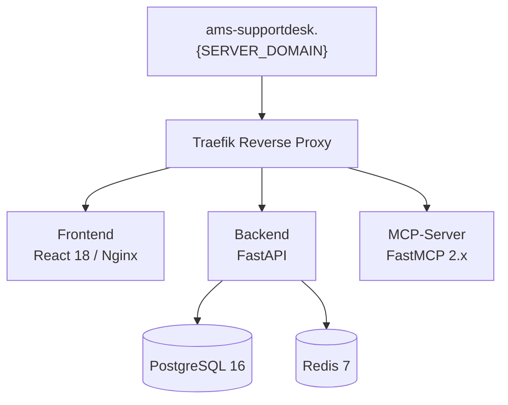
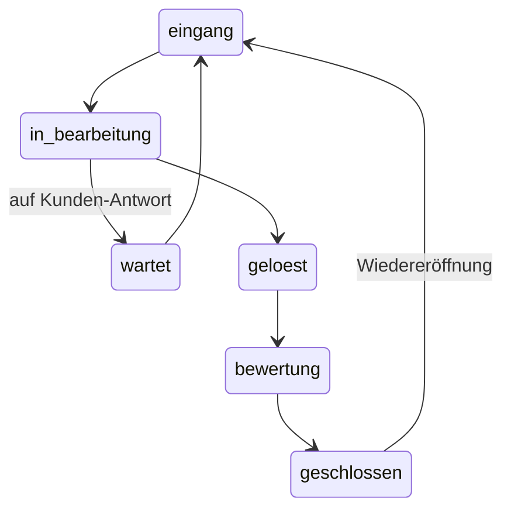

# ams.SupportDesk

KI-gestütztes Support-Tool auf Basis von FastAPI, React und FastMCP. Das System verbindet Supporter, Kunden und KI-Assistenz in einer integrierten Plattform und ist vollstaendig in die THoster-Infrastruktur integriert.

---

## Inhaltsverzeichnis

- [Uebersicht](#uebersicht)
- [Architektur](#architektur)
- [Voraussetzungen](#voraussetzungen)
- [Installation & Start](#installation--start)
- [Konfiguration](#konfiguration)
- [Dienste & Routen](#dienste--routen)
- [Backend](#backend)
- [Frontend](#frontend)
- [MCP-Server](#mcp-server)
- [Ticket-Statusmaschine](#ticket-statusmaschine)
- [Projektstruktur](#projektstruktur)

---

## Uebersicht

ams.SupportDesk ist ein mehrschichtiges Support-System mit folgenden Kernfunktionen:

- **Supporter-Arbeitsplatz**: Split-Layout mit Kunden-Chat und KI-Recherche
- **Kunden-Portal**: Webbasiertes Chat-Interface fuer Kunden
- **KI-Assistenz**: Echtzeit-Recherche ueber ams-connections / Agent Hub
- **Eingangskorb**: Live-Updates per WebSocket fuer neue Tickets
- **Admin-Bereich**: Verwaltung von Templates, Phasen-Texten, Modellen, MCP-Servern und RAG-Collections
- **MCP-Server**: Tools fuer Claude Code / Agent Hub zur Ticket-Abfrage

**Primaerfarbe**: `#003459` (dunkles Blau)

---

## Architektur



**5 Docker-Services:**

| Service     | Image/Build      | Port intern | Traefik-Pfad         |
|-------------|------------------|-------------|----------------------|
| frontend    | ./frontend       | 80          | `/` (Prio 1)         |
| backend     | ./backend        | 8000        | `/api` (Prio 20)     |
| mcp-server  | ./mcp-server     | 8080        | `/mcp` (Prio 40)     |
| db          | postgres:16      | 5432        | intern               |
| redis       | redis:7          | 6379        | intern               |

---

## Voraussetzungen

- Docker und Docker Compose (v2)
- THoster-Netzwerk `thoster-net` muss existieren
- Traefik laeuft als Reverse Proxy im THoster-Netz

---

## Installation & Start

### 1. Repository klonen

```bash
git clone <repository-url>
cd ams.SupportDesk
```

### 2. Umgebungsvariablen konfigurieren

```bash
cp .env.example .env
# .env anpassen (Datenbankpasswort, SECRET_KEY, SERVER_DOMAIN)
```

### 3. Docker-Container bauen und starten

```bash
docker compose up -d --build
```

### 4. Erreichbarkeit pruefen

```bash
curl -I http://ams-supportdesk.192.168.x.x.sslip.io/
curl -I http://ams-supportdesk.192.168.x.x.sslip.io/api/health
```

---

## Konfiguration

Alle Konfiguration erfolgt ueber die `.env` Datei (Vorlage: `.env.example`):

| Variable          | Beschreibung                                   | Beispielwert                     |
|-------------------|------------------------------------------------|----------------------------------|
| DB_HOST           | Datenbankhost (Docker-Service-Name)            | `db`                             |
| DB_PORT           | Datenbankport                                  | `5432`                           |
| DB_NAME           | Datenbankname                                  | `supportdesk`                    |
| DB_USER           | Datenbankbenutzer                              | `supportdesk`                    |
| DB_PASSWORD       | Datenbankpasswort (sicheres Passwort)          | `CHANGE_ME_secure_password`      |
| REDIS_URL         | Redis-Verbindungs-URL                          | `redis://redis:6379/0`           |
| SECRET_KEY        | JWT/Session-Secret (langer Zufallsstring)      | `CHANGE_ME_random_long_string`   |
| SERVER_DOMAIN     | THoster-Domain fuer Traefik                    | `192.168.x.x.sslip.io`          |
| INTERNAL_API_KEY  | Internes Service-Token (MCP-Server -> Backend) | `CHANGE_ME_internal_token`       |
| OPENAI_API_KEY    | API-Key fuer OpenAI (optional)                 | `sk-...`                         |
| ANTHROPIC_API_KEY | API-Key fuer Anthropic Claude (optional)       | `sk-ant-...`                     |

---

## Dienste & Routen

| Route                          | Beschreibung                    |
|--------------------------------|---------------------------------|
| `/`                            | Supporter-Login & Dashboard     |
| `/workspace/:id`               | Support-Workspace (Split-Layout)|
| `/portal`                      | Kunden-Portal                   |
| `/admin`                       | Admin-Bereich                   |
| `/statistik`                   | Statistik & Analytics           |
| `/api/...`                     | Backend REST-API                |
| `/api/ws/...`                  | WebSocket-Endpunkte             |
| `/mcp/...`                     | MCP-Server (SSE/Streamable HTTP)|

---

## Backend

**Technologien:** FastAPI 0.115 | SQLAlchemy 2.0 async | asyncpg | Pydantic 2 | Redis 5 | WebSockets | httpx (LLM-Aufrufe)

### Datenmodelle (13)

| Modell               | Beschreibung                              |
|----------------------|-------------------------------------------|
| Supporter            | Support-Mitarbeiter (Kuerzel-basiert)     |
| Kunde                | Kundenstammdaten                          |
| Ticket               | Support-Ticket mit Statusmaschine         |
| TicketTag            | Tags zur Ticket-Kategorisierung           |
| ChatSession          | Chat-Sitzung (Kunde <-> Supporter)        |
| Nachricht            | Einzelne Chat-Nachricht                   |
| KIRechercheVerlauf   | KI-Recherche-Session pro Ticket           |
| KINachricht          | Einzelne KI-Nachricht/Antwort             |
| Bewertung            | Kundenbewertung nach Abschluss            |
| Template             | Antwort-Vorlagen fuer Supporter           |
| PhasenText           | Automatische Texte je Ticket-Phase        |
| MCPServerRegistry    | Registrierte MCP-Server                   |
| AppSetting           | Anwendungseinstellungen (Key-Value)       |

### API-Router (13)

| Router          | Prefix                   | Beschreibung                             |
|-----------------|--------------------------|------------------------------------------|
| auth            | `/api/auth`              | Supporter-Authentifizierung              |
| kunden          | `/api/kunden`            | Kundenverwaltung                         |
| kunden_portal   | `/api/portal`            | Kunden-Portal-Endpunkte                  |
| tickets         | `/api/tickets`           | Ticket-CRUD und Statusaenderungen        |
| tags            | `/api/tags`              | Tag-Verwaltung                           |
| chat_sessions   | `/api/chat-sessions`     | Chat-Session-Verwaltung                  |
| nachrichten     | `/api/nachrichten`       | Nachrichten-CRUD inkl. Delete            |
| eingangskorb    | `/api/eingangskorb`      | Eingangskorb-Abfrage                     |
| connections     | `/api/connections`       | ams-connections Integration              |
| ki_recherche    | `/api/v1/ki-recherche`   | KI-Recherche-Chat (Verlauf, Nachrichten, LLM) |
| statistik       | `/api/v1/statistik`      | Statistik & Analytics (6 Tabs)           |
| ws              | `/api/ws`                | WebSocket (Ticket-Chat + Eingangskorb)   |
| admin           | `/api/admin`             | Admin-Verwaltung inkl. Systemprompt      |

---

## Frontend

**Technologien:** React 18 | Vite | TypeScript | Chakra UI v3 | Tailwind CSS 3

### Seiten & Komponenten

| Pfad              | Komponente            | Beschreibung                              |
|-------------------|-----------------------|-------------------------------------------|
| `/`               | SupporterLogin        | Kuerzel-basierter Login                   |
| `/tickets`        | TicketList            | Tabs: Meine / Eingang / Alle              |
| `/workspace/:id`  | TicketWorkspace       | Split: KundenChat + KIChat                |
| `/portal`         | PortalLogin + Chat    | Kunden-Portal                             |
| `/admin`          | AdminPage             | Tab-basierte Admin-Verwaltung             |
| `/statistik`      | StatistikPage         | Statistik & Analytics (6 Tabs)            |

### Admin-Manager-Komponenten

- **TemplateManager** – Antwort-Vorlagen erstellen und verwalten
- **PhasenTexteManager** – Automatische Texte je Ticket-Status (eingeklappt/aufklappbar, hellblaue Eingabefelder)
- **ModelleManager** – KI-Modelle konfigurieren und als Standard setzen
- **MCPServerManager** – MCP-Server registrieren und synchronisieren; Klick auf Card oeffnet Bearbeitungsformular, aktive Server werden oben sortiert, Toggle-Button fuer Aktiv/Inaktiv, verzoegertes Umsortieren nach Toggle
- **RAGCollectionManager** – RAG-Collections verwalten; Toggle zum Aktivieren/Deaktivieren pro Collection (analog zu MCP-Server), aktive Collections werden oben sortiert, Aktivierungszustand wird in App-Settings persistiert (`rag_active_collections`)
- **KISettingsManager** (Phase 2) – KI-spezifische Einstellungen: konfigurierbarer Systemprompt fuer den Recherche-Assistenten
- **SettingsManager** – Allgemeine App-Einstellungen (ohne KI-Prompt, separater Tab)

### Statistik & Analytics-Komponenten (Phase 3)

- **StatistikPage** – Wrapper mit globaler Filter-Leiste (Zeitraum-Presets, Custom DateRange, Supporter-Filter) und Tab-Navigation
- **StatistikUebersicht** – KPI-Karten (Gesamttickets, offene Tickets, geloeste Tickets, Ø Loesungszeit) und Trendcharts
- **StatistikSupporter** – Supporter-Performance: Tickets pro Supporter, Loesungszeiten, Workload-Verteilung
- **StatistikKunden** – Kunden-Analyse: aktivste Kunden, Ticket-Haeufigkeit, Loesungszeiten pro Kunde
- **StatistikZeiten** – Zeitanalysen: Tickets nach Wochentag/Stunde, Peak-Zeiten, Bearbeitungsdauern
- **StatistikQualitaet** – Qualitaetsmetriken: Bewertungs-Auswertung, Kundenzufriedenheit, SLA-Einhaltung
- **StatistikKI** – KI-Nutzungsstatistiken: Recherche-Haeufigkeit, meistgenutzte Collections, Uebernahme-Rate

### Wiederverwendbare Chart-Komponenten

- **KpiCard** – KPI-Karte mit Wert, Trend-Indikator und optionalem Vergleichszeitraum
- **TrendChart** – Linien-/Balkendiagramm fuer Zeitreihen (basiert auf recharts)
- **DistributionChart** – Kreisdiagramm / Balkendiagramm fuer Verteilungen (basiert auf recharts)

### Shared-Komponenten

- **TemplatePicker** (Phase 2) – Wiederverwendbarer Template-Picker mit `/`-Trigger-Suche; wird in KundenChat und KIChat eingesetzt

### Custom Hooks

| Hook            | Beschreibung                              |
|-----------------|-------------------------------------------|
| useAuth         | Authentifizierungsstatus und Login-Flow   |
| useTickets      | Ticket-Datenabruf und -verwaltung         |
| useWebSocket    | WebSocket-Verbindung mit Auto-Reconnect   |

---

## MCP-Server

**Technologien:** FastMCP 2.x | httpx

Der MCP-Server stellt 6 Tools fuer Claude Code und den Agent Hub bereit. Alle Aufrufe werden mit dem internen Service-Token (`X-Internal-Token` Header) gegen das Backend authentifiziert – ohne Cookie-Session.

| Tool                    | Parameter             | Beschreibung                                                    |
|-------------------------|-----------------------|-----------------------------------------------------------------|
| `tickets_auflisten`     | `status`, `limit`     | Tickets auflisten; gibt Ticketnummern + Supporter-Kuerzel aus   |
| `ticket_details`        | `ticket_nummer: int`  | Details zu einem Ticket per Ticketnummer (z.B. `1001`)          |
| `ticket_suchen`         | `query`, `limit`      | Volltext-Suche in Titel/Kundenname; gibt Ticketnummern aus      |
| `eingangskorb_anzeigen` | –                     | Unbearbeitete Tickets im Eingangskorb mit Ticketnummer          |
| `kunde_suchen`          | `query`               | Kunden nach Name oder Kundennummer suchen                       |
| `tags_auflisten`        | `limit`               | Beliebteste Tags ueber alle Tickets auflisten                   |

**Endpunkt:** `http://ams-supportdesk.{SERVER_DOMAIN}/mcp` (Streamable HTTP)

### MCP-Server Authentifizierung

Der MCP-Server kommuniziert intern mit dem Backend ausschliesslich ueber den `X-Internal-Token` Header. Das Backend prueft diesen gegen `INTERNAL_API_KEY` und erstellt bei Bedarf automatisch einen `SYSTEM`-Supporter-Eintrag. Cookie-basierte Authentifizierung ist fuer den MCP-Server nicht erforderlich.

---

## KI-Recherche (Phase 2)

Der Supporter-Arbeitsplatz verfuegt ueber einen vollstaendigen KI-Recherche-Chat:

- **LLM-Router** (`services/llm_router.py`) – Abstraktion fuer OpenAI-kompatible Provider (OpenAI, Ollama, vLLM, Groq, Mistral) und Anthropic Claude; automatische Erkennung per `provider_type`
- **KI-Recherche-API** (`/api/v1/ki-recherche`) – Verwaltet Recherche-Verlaeufe pro Ticket, speichert Konversationen, ruft LLM auf, integriert RAG-Kontext
- **RAG-Integration** – Collections koennen pro Anfrage gezielt ausgewaehlt werden; Fallback auf `rag_active_collections` aus Settings
- **Konfigurierbarer Systemprompt** – Prompt fuer den Recherche-Assistenten wird in `AppSetting` (Key: `ki_system_prompt`) gespeichert und ist im Admin-Bereich editierbar
- **WebSocket-Broadcast** – KI-Antworten werden per WebSocket an alle verbundenen Clients gesendet (`type: ki_nachricht`)

### KI-Recherche-API-Endpunkte

| Methode  | Pfad                                              | Beschreibung                             |
|----------|---------------------------------------------------|------------------------------------------|
| GET      | `/api/v1/ki-recherche/{ticket_id}`               | Aktiven Verlauf laden                    |
| POST     | `/api/v1/ki-recherche/{ticket_id}`               | Neuen Verlauf starten                    |
| GET      | `/api/v1/ki-recherche/{verlauf_id}/nachrichten`  | Nachrichten eines Verlaufs laden         |
| POST     | `/api/v1/ki-recherche/{verlauf_id}/nachrichten`  | Nachricht senden + KI-Antwort erhalten   |
| PATCH    | `/api/v1/ki-recherche/{verlauf_id}/nachrichten/{id}/uebernehmen` | Als uebernommen markieren |
| DELETE   | `/api/v1/ki-recherche/{verlauf_id}/nachrichten/{id}` | KI-Nachricht loeschen              |

---

## Statistik & Analytics (Phase 3)

Die Statistik-Seite (`/statistik`) bietet umfassende Auswertungen des Support-Betriebs. Alle Endpunkte sind Auth-geschuetzt und unterstuetzen gemeinsame Filter:

**Gemeinsame Query-Parameter:**

| Parameter     | Typ    | Beschreibung                         |
|---------------|--------|--------------------------------------|
| `von`         | string | ISO-Datum Beginn (z.B. `2026-01-01`) |
| `bis`         | string | ISO-Datum Ende                       |
| `supporter_id`| UUID   | Einschraenkung auf einen Supporter   |
| `kunde_id`    | UUID   | Einschraenkung auf einen Kunden      |

### Statistik-API-Endpunkte

| Methode | Pfad                          | Beschreibung                                           |
|---------|-------------------------------|--------------------------------------------------------|
| GET     | `/api/v1/statistik/uebersicht` | KPI-Uebersicht: Ticket-Volumen, Loesungszeiten, Trends |
| GET     | `/api/v1/statistik/supporter`  | Supporter-Performance und Workload-Verteilung          |
| GET     | `/api/v1/statistik/kunden`     | Kunden-Analyse: aktivste Kunden, Loesungszeiten        |
| GET     | `/api/v1/statistik/zeiten`     | Zeitanalysen: Peak-Zeiten, Tagesverteilung             |
| GET     | `/api/v1/statistik/qualitaet`  | Qualitaet: Bewertungen, Kundenzufriedenheit            |
| GET     | `/api/v1/statistik/ki`         | KI-Nutzung: Recherchen, Collections, Uebernahmen       |

---

## Ticketnummern

Tickets erhalten beim Anlegen eine fortlaufende, lesbare `nummer` (auto-increment, nicht die UUID). Diese wird im Kunden-Portal zum Einloggen verwendet und in allen Listen/Komponenten angezeigt.

---

## Ticket-Statusmaschine



---

## Projektstruktur

```
ams.SupportDesk/
├── .env.example             # Konfigurationsvorlage
├── .gitignore
├── docker-compose.yml       # 5-Service-Stack
├── register-ams-supportdesk.json  # THoster-Registrierung
│
├── backend/
│   ├── Dockerfile
│   ├── pyproject.toml       # FastAPI + SQLAlchemy + asyncpg
│   └── app/
│       ├── main.py          # FastAPI-App, CORS, Router-Registrierung
│       ├── config.py        # Pydantic Settings
│       ├── database.py      # Async SQLAlchemy Engine
│       ├── middleware/      # Auth-Middleware
│       ├── models/          # 13 SQLAlchemy-Modelle
│       ├── routers/         # 13 API-Router (inkl. ki_recherche, statistik)
│       ├── schemas/         # Pydantic-Schemas
│       └── services/        # ConnectionManager, ConnectionsClient, LLMRouter
│
├── frontend/
│   ├── Dockerfile
│   ├── nginx.conf
│   ├── package.json         # React 18 + Vite + Chakra UI v3
│   └── src/
│       ├── App.tsx          # Routing
│       ├── main.tsx
│       ├── components/      # Admin, Eingangskorb, Portal, Statistik, Tickets, Workspace
│       ├── hooks/           # useAuth, useTickets, useWebSocket
│       ├── lib/             # api.ts, types.ts
│       └── theme/           # Chakra UI Theme (#003459)
│
└── mcp-server/
    ├── Dockerfile
    ├── pyproject.toml       # FastMCP 2.x + httpx
    └── server.py            # 6 MCP-Tools
```

---

## THoster-Integration

Das Projekt registriert sich ueber `register-ams-supportdesk.json` am THoster-System. Die Konfiguration fuer Claude Code / Agent Hub ist unter `http://192.168.0.52.sslip.io/admin/claude` abrufbar.

### MCP-Server Sync

Der Admin-Bereich synchronisiert MCP-Server automatisch aus der THoster-Tool-Liste. Dabei gilt:

- Die URL des MCP-Servers wird direkt aus dem Feld `mcp_server_address` der THoster API bezogen
- Tools ohne `mcp_server_address` werden uebersprungen oder bestehende Eintraege entfernt
- Neu synchronisierte Server werden standardmaessig **deaktiviert** angelegt (manuelle Aktivierung erforderlich)
- Das Sync-Ergebnis liefert Zaehler fuer `synced`, `skipped`, `removed` und `total_tools`

### RAG-Collections

Der Backend-Router probiert beim Abruf von RAG-Collections mehrere Kandidaten-URLs in dieser Reihenfolge:

1. `http://{docker_name}-backend-1:8000/api/v1/collections` (Docker-interne Konvention)
2. `http://{tool-name}.{SERVER_DOMAIN}/api/v1/collections` (Traefik-Hostname)
3. Konfigurierte URL aus `rag_server.url` (falls vorhanden)

---

## Lizenz

Intern – ams.projects
